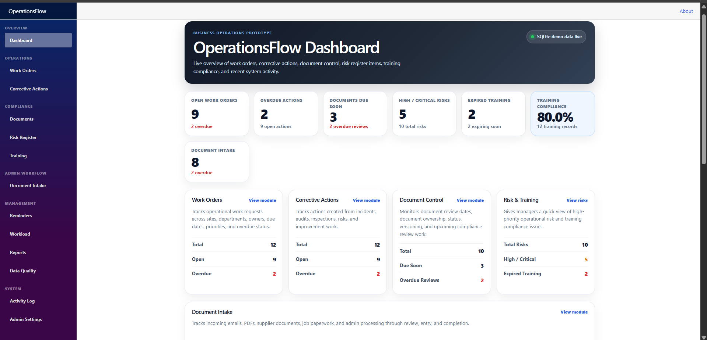
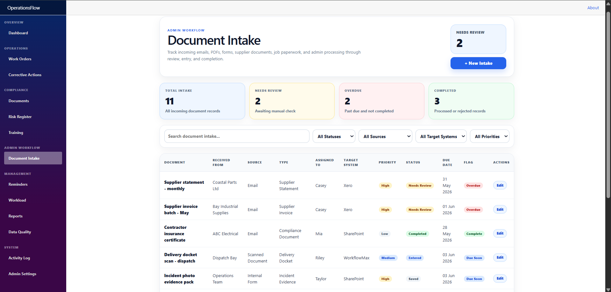
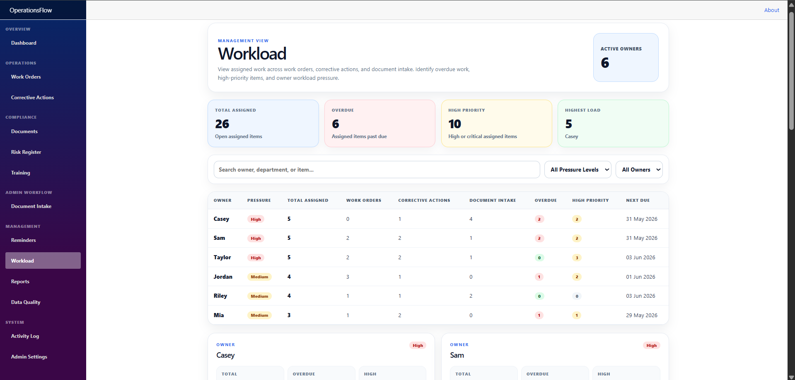
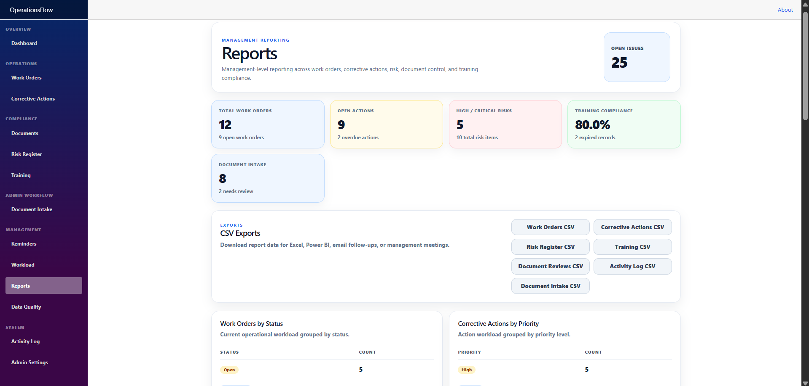
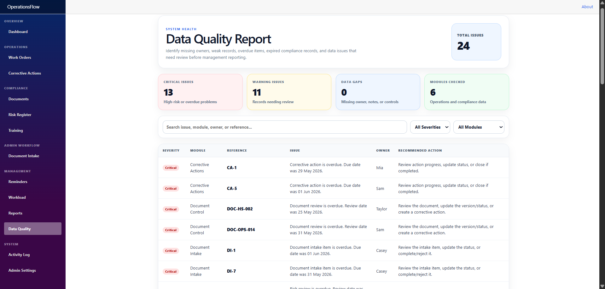
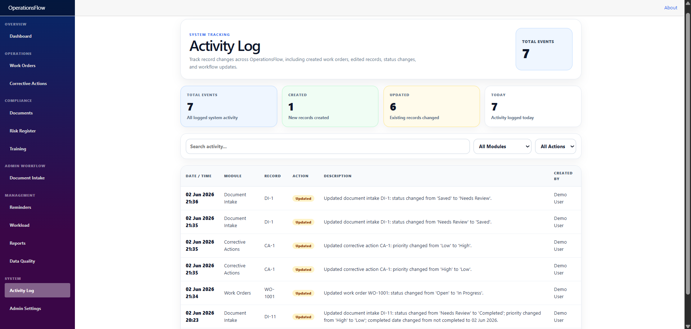
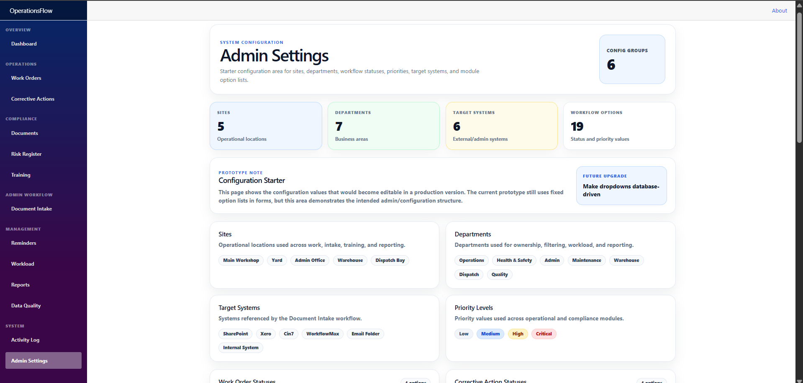
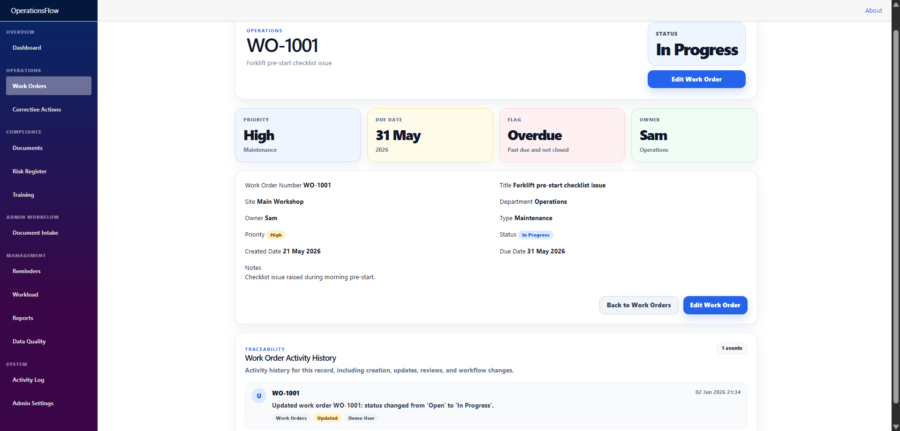

# OperationsFlow

**OperationsFlow v1.1 Portfolio Prototype** is a semi-live Blazor/.NET business operations prototype for tracking work orders, corrective actions, safety/compliance issues, document intake, reminders, workload, reports, CSV exports, data quality, and activity traceability.

It was built as a focused portfolio project to demonstrate practical business systems development: turning scattered admin, operations, compliance, document follow-up, risk, training, and corrective action work into one searchable workflow system.

> **Demo status:** OperationsFlow currently uses local SQLite and seeded demo data. It demonstrates workflow behaviour, reporting, exports, activity traceability, reminders, workload visibility, data quality checks, and a safety/compliance overview. It is not yet a production deployment and does not currently include authentication, role permissions, live integrations, file storage, or production hosting.

---

## Project Metrics

Current prototype includes:

- 14+ app pages/modules
- 7 CSV export endpoints
- 3 full create/edit workflows:
  - Work Orders
  - Corrective Actions
  - Document Intake
- 3 linked corrective action generation paths:
  - Risk Register → Corrective Action
  - Document Control → Corrective Action
  - Training Compliance → Corrective Action
- Safety Overview dashboard for OSHE/compliance review
- Global Activity Log
- Per-record Activity History
- Dashboard KPIs
- Reminder Centre
- Workload page
- Reports page
- Data Quality Report
- Admin Settings starter
- SQLite persistence
- Portfolio documentation package

---

## What This Project Demonstrates

OperationsFlow demonstrates my ability to:

- Design practical business workflows around real operational problems.
- Build CRUD modules using C#, Blazor, Entity Framework Core, and SQLite.
- Create dashboard KPIs, reports, reminders, CSV exports, and workload views.
- Track activity history globally and per record.
- Model admin/document intake, compliance follow-up, risk, training, document review, and corrective action processes.
- Build focused management views for safety, compliance, operations, workload, reporting, and system health.
- Build a prototype with a clear path toward enterprise features such as authentication, permissions, integrations, database-driven settings, file handling, service-layer separation, automated tests, and production deployment.

---

## Screenshots

### Dashboard



The dashboard gives a manager a quick overview of open work, overdue actions, document intake status, training compliance, risk, and recent system activity.

### Safety / Compliance Overview


Safety Overview gives a health, safety, or compliance manager a focused view of open corrective actions, overdue corrective actions, high/critical risks, expired training, document review issues, and recent compliance activity.

### Document Intake



Document Intake tracks incoming emails, PDFs, scanned documents, supplier documents, customer requests, internal forms, and job paperwork through review, entry, and completion.

### Workload



The Workload page groups assigned work by owner/person, showing open work, overdue items, high-priority items, and workload pressure.

### Reports



Reports provide management-level summaries across operational work, corrective actions, risk, training, document reviews, and document intake, with CSV export options for Excel, Power BI, email follow-ups, or management meetings.

### Data Quality Report



The Data Quality Report identifies weak or risky records, including missing owners, blank notes, overdue work, expired training, document review issues, and document intake follow-ups.

### Activity Log



The Activity Log provides traceability for created, updated, and reviewed records across the system.

### Admin Settings



Admin Settings is a starter configuration area showing the direction for future database-driven settings and editable option lists.

### Work Order Activity History



Per-record Activity History shows the audit trail for a single record, including creation, updates, reviews, and workflow changes.

---

## Project Purpose

Many small businesses manage operations through a mix of emails, spreadsheets, paper forms, PDFs, shared folders, and manual follow-ups. That can make it hard to know:

- What work is overdue.
- Who owns each action.
- Which corrective actions need attention.
- Which risks are high or critical.
- Which documents need review.
- Which training records are expired or expiring soon.
- Which incoming documents still need processing.
- What needs attention today.
- What can be exported for management reporting.

OperationsFlow is a prototype showing how those workflows could be centralised into a simple internal system.

---

## Tech Stack

- .NET 8
- Blazor
- C#
- Entity Framework Core
- SQLite
- Razor Components
- HTML/CSS
- CSV export endpoints
- Git/GitHub

---

## Architecture

Current prototype structure:

```text
Blazor UI
↓
Razor Components / Pages
↓
Application Services
↓
Entity Framework Core
↓
SQLite Database
```

Current services include:

- `DashboardService`
- `ActivityLogService`
- `CsvExportService`

The future enterprise direction is to move more business logic into services, add database-driven settings, introduce authentication/roles, support production databases, add automated tests, and integrate with business systems such as SharePoint, Outlook, Teams, Xero, Cin7, and WorkflowMax-style tools.

---

## Core Features

### Dashboard

- Live KPI cards.
- Summary panels for operations, compliance, training, document intake, and recent work.
- Recent activity feed.
- Links into main workflow modules.

### Safety Overview

- Focused OSHE/compliance dashboard.
- Open corrective action count.
- Overdue corrective action count.
- High/critical risk visibility.
- Expired and expiring training visibility.
- Overdue and due-soon document review visibility.
- Recent safety/compliance activity.
- Quick links into Risk Register, Corrective Actions, Training, Documents, and Activity Log.

### Work Orders

- List/search/filter.
- Create work order.
- Edit work order.
- View work order details.
- Per-record activity history.
- Overdue tracking.
- Dashboard/report integration.

### Corrective Actions

- List/search/filter.
- Create corrective action.
- Edit corrective action.
- Completed date automation.
- Activity logging.
- Corrective actions can be generated from Risk Register, Document Control, and Training modules.

### Document Intake

Tracks incoming documents and admin processing work, including:

- Emails
- PDFs
- Scanned documents
- Supplier documents
- Customer requests
- Internal forms
- Job paperwork

Fields include:

- Document name
- Received date
- Received from
- Source type
- Document type
- Assigned to
- Target system
- Priority
- Status
- Due date
- Completed date
- Notes

Target systems include:

- SharePoint
- Xero
- Cin7
- WorkflowMax
- Email Folder
- Internal System

These target systems are tracked as workflow metadata in the current prototype. The app does not currently integrate live with those systems.

### Compliance Modules

- Safety Overview
- Document Control
- Risk Register
- Training Compliance

Risk items, document reviews, and training issues can generate corrective actions.

### Management Views

- Reminder Centre
- Workload page grouped by owner/person
- Reports page
- Data Quality Report
- Activity Log
- Admin Settings starter
- Demo Guide page, if added

### CSV Exports

CSV export endpoints are available for:

- Work Orders
- Corrective Actions
- Risk Register
- Training
- Document Reviews
- Activity Log
- Document Intake

---

## Vanessa / OSHE Demo Path

A strong safety/compliance-focused demo path:

1. Open Safety Overview and explain the attention items.
2. Show high/critical risks and overdue risk reviews.
3. Open Risk Register and generate a corrective action from a risk.
4. Open Corrective Actions and show ownership, priority, due dates, and status.
5. Open Training Compliance and show expired/expiring training records.
6. Open Documents and show overdue/due-soon document reviews.
7. Open Reminder Centre to show what needs attention.
8. Open Data Quality to show system health issues before reporting.
9. Open Reports and show CSV export options.
10. Open Activity Log or per-record Activity History to show traceability.

---

## General Demo Workflow

A strong general demo path:

1. Open the Dashboard and explain the live KPIs.
2. Open Safety Overview and explain the compliance attention items.
3. Open Work Orders and show list, edit, details, and activity history.
4. Open Document Intake and create a new incoming document record.
5. Edit the intake status to Needs Review or Completed.
6. Show Activity Log and per-record Activity History.
7. Open Reminder Centre to show overdue and due-soon items.
8. Open Workload to show assigned work grouped by owner.
9. Open Reports and show management summaries.
10. Download a CSV export.
11. Open Data Quality to show system health checks.
12. Open Admin Settings to explain future configuration.

---

## Current Prototype vs Future Enterprise Version

| Area | Current Prototype | Future Enterprise Version |
|---|---|---|
| Database | Local SQLite | SQL Server, Azure SQL, or PostgreSQL |
| Data | Demo seed data | Real business data with migrations/backups |
| Users | Demo user text | Authentication and role-based permissions |
| Settings | Starter Admin Settings page, some hardcoded options | Editable database-driven settings |
| Activity | Global Activity Log and per-record Activity History | Per-field audit trail with old/new values and real user IDs |
| Documents | Document Intake metadata/workflow tracking | File upload, storage, preview, and document security |
| Integrations | Target systems tracked as metadata only | SharePoint, Outlook, Teams, Xero, Cin7, WorkflowMax-style integrations |
| Reporting | App reports and CSV exports | Scheduled reports, Power BI feed, richer analytics |
| Deployment | Local development/demo app | Hosted production deployment |
| Testing | Manual testing | Unit/integration tests and CI/CD pipeline |

---

## How To Run

1. Clone the repository.
2. Open the solution in Visual Studio.
3. Restore NuGet packages if required.
4. Run the Blazor app.
5. If the SQLite schema changes during prototype development, delete the local database files and restart the app:
   - `operationsflow.db`
   - `operationsflow.db-shm`
   - `operationsflow.db-wal`

---

## Current Prototype Limitations

This is a portfolio/semi-live prototype, not a production enterprise deployment.

Current limitations:

- Uses local SQLite.
- Uses demo seed data.
- No real authentication.
- No role-based permissions.
- No hosted deployment.
- No live SharePoint/Outlook/Teams/Xero/Cin7/WorkflowMax integrations.
- No file upload, file storage, OCR, or AI extraction.
- Admin Settings is currently a starter/configuration direction page.
- Some option lists are still hardcoded in forms.
- No full service-layer refactor yet.
- No API layer yet.
- No automated test suite yet.
- Database schema management is currently prototype-level rather than production migrations.

---

## Enterprise Roadmap

Planned enterprise upgrades:

- SQL Server, PostgreSQL, or Azure SQL support.
- EF Core migrations.
- Authentication with Microsoft Entra ID or ASP.NET Core Identity.
- Role-based permissions.
- Database-driven admin settings.
- Service-layer refactor.
- API layer.
- Per-field audit trail.
- File upload/document attachment support.
- SharePoint document library integration.
- Outlook email intake.
- Teams/email notifications.
- Xero/Cin7/WorkflowMax integration layer.
- OCR/AI-assisted document extraction.
- Automated data validation rules.
- Unit/integration tests.
- CI/CD pipeline.
- Production hosting and deployment pipeline.

---

## Additional Documentation

- [Case Study](Docs/CaseStudy.md)
- [Architecture](Docs/Architecture.md)
- [Technical Decisions](Docs/TechnicalDecisions.md)
- [Demo Walkthrough](Docs/DemoWalkthrough.md)
- [Feature Checklist](Docs/FeatureChecklist.md)
- [Known Limitations](Docs/KnownLimitations.md)
- [Enterprise Upgrade Plan](Docs/EnterpriseUpgradePlan.md)
- [Targeted Pitch Notes](Docs/TargetedPitches.md)

---

## Portfolio Summary

OperationsFlow is a practical business systems portfolio project built with C#, Blazor, EF Core, SQLite, workflow logic, reporting, exports, and traceability.

It shows that I can design and build software that businesses understand: tracking work, assigning responsibility, monitoring safety/compliance issues, reviewing documents, managing training visibility, exporting data, and planning a realistic enterprise upgrade path.
