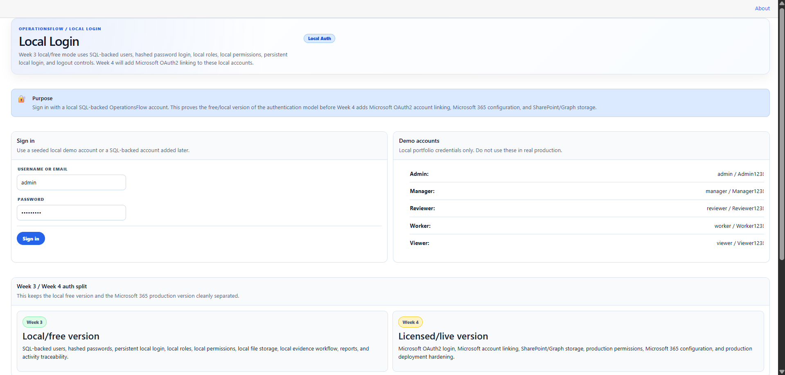
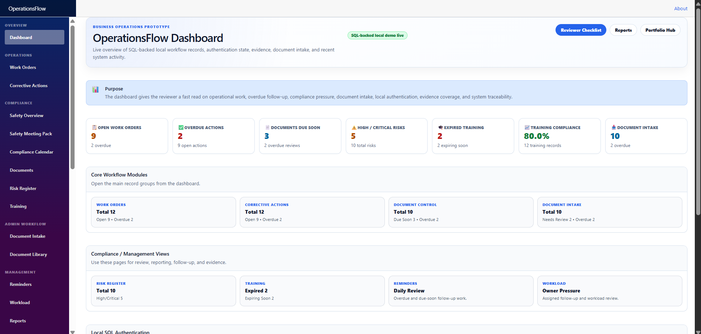
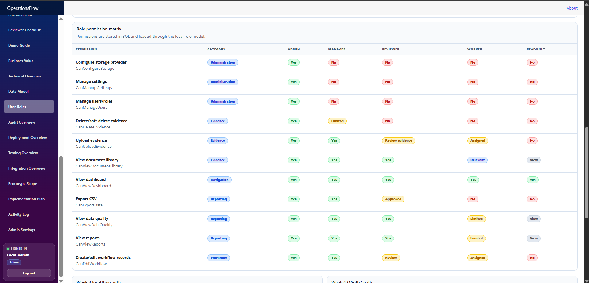
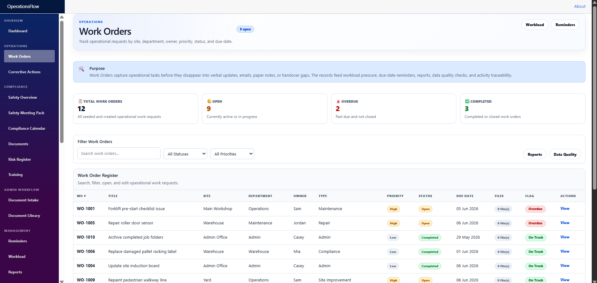
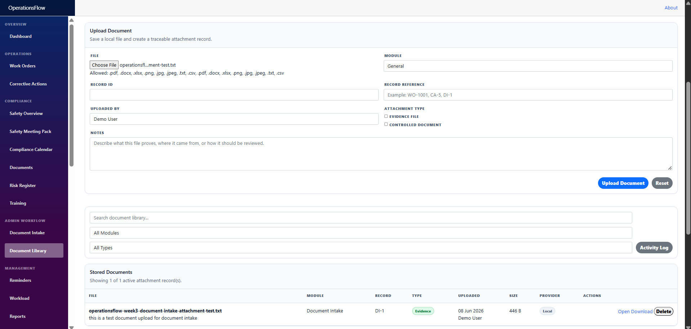
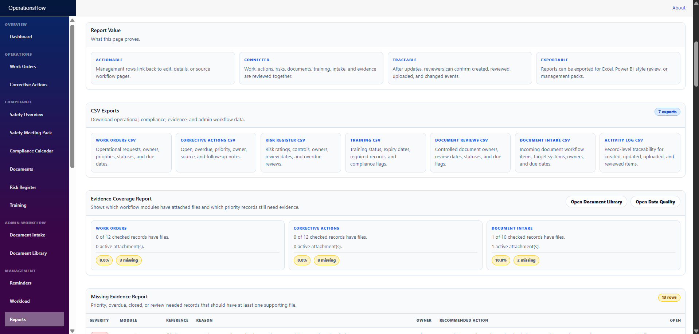

# OperationsFlow

> **Current status:** Week 3 Production Foundation is complete. OperationsFlow now has local SQL-backed authentication, login/logout, session-based local access, seeded users/roles/permissions, protected navigation, permission-controlled workflow actions, local evidence storage, document attachments, evidence-aware data quality checks, management reports, and a clear Microsoft 365 / SharePoint / Graph upgrade path for Week 4.

OperationsFlow is **not yet a live production deployment**. It is a manager-review-ready local pilot/prototype with production-shaped architecture. The next stage is Week 4: connecting the finished local foundation to the Microsoft 365 tenant with Entra ID/OAuth2 and SharePoint/Graph storage.

## Project Purpose

OperationsFlow is a practical internal business workflow system built to prove that scattered operational work can be captured, reviewed, prioritised, evidenced, and reported from one place.

It is designed around real workplace patterns:

- work orders and operational requests
- corrective actions and source-linked follow-up work
- document intake and document processing
- controlled document review
- training compliance follow-up
- risk register follow-up
- document/evidence attachments
- management reports
- data quality checks
- activity traceability
- role-based workflow access
- Microsoft 365 / SharePoint production readiness

## What This Project Demonstrates

- .NET 8 / Blazor application development.
- Entity Framework Core persistence.
- SQLite/local development support and SQL Server/LocalDB production-foundation support.
- Local SQL-backed authentication and seeded demo accounts.
- Local roles and permissions stored in SQL.
- Enforced page/action permissions for workflow actions, evidence uploads/deletes, exports, settings, and user management.
- Shared UI components and consolidated styling.
- Workflow modules connected through reports, reminders, workload, activity history, and data quality.
- Local file storage abstraction that can be swapped to SharePoint in Week 4.
- Record-level attachments and document library evidence tracking.
- Evidence-aware data quality and reporting.
- Clear Microsoft 365 / SharePoint / Graph upgrade path.

## Current Project Metrics

- Local SQL-backed authentication: implemented.
- Session-based login/logout: implemented using browser session storage.
- Local roles/permissions: implemented.
- ReadOnly permission enforcement: implemented and tested.
- Admin workflow actions: implemented and tested.
- Local file/evidence storage: implemented.
- Record attachment panels: implemented.
- Document Library: implemented.
- Data Quality missing-evidence checks: implemented.
- Reports evidence coverage: implemented.
- Microsoft 365 tenant access: available for Week 4 setup.
- Microsoft 365 integration: not yet connected.

## Screenshot Preview

The screenshots below show the strongest Week 3 review path first: local login, SQL-backed dashboard, roles/permissions, ReadOnly enforcement, evidence storage, and management reporting.

### 1. Login Page / Local SQL Authentication



### 2. Dashboard / SQL Auth Overview



### 3. User Roles / Permission Model



### 4. ReadOnly Work Orders / No Create or Edit Actions



### 5. Admin Document Library / Upload and Delete Actions



### 6. Reports / Evidence Coverage and Exports



More screenshots are available in [`Docs/Screenshots`](Docs/Screenshots), ordered by review relevance.

## Core Features

### Dashboard

Shows operational status, workflow counts, recent activity, and local SQL authentication status.

### Work Orders

Tracks operational work by site, department, owner, priority, status, due date, file count, details page, activity history, and attachments.

### Corrective Actions

Tracks corrective/improvement actions from incidents, audits, inspections, risks, training gaps, document reviews, and compliance follow-ups.

### Document Intake

Captures incoming document workflow items and links them to record-level attachments and Document Library evidence.

### Document Library

Stores uploaded local evidence files with module, record reference, type, uploaded-by, notes, provider, and soft-delete metadata.

### Record Attachments

Reusable component for Work Orders, Corrective Actions, and Document Intake detail pages. Upload/delete actions are permission-controlled.

### Risk Register / Training / Documents

Compliance pages can create source-linked corrective actions when the signed-in user has workflow edit permission.

### Reports

Shows management pressure, workflow counts, evidence coverage, missing evidence, and cross-module review tables. CSV exports are hidden unless the user has export permission.

### Data Quality

Flags missing or weak data, including priority records that are missing supporting evidence.

### Activity Log

Global traceability page for created, updated, uploaded, deleted, and reviewed events. CSV export is permission-controlled.

### User Roles / Admin Settings

Explains and demonstrates the local SQL role/permission model, admin configuration boundary, local/Week 3 setup, and Week 4 Microsoft 365 upgrade path.

## Tech Stack

- .NET 8
- Blazor
- C#
- Entity Framework Core
- SQLite for simple local development/demo scenarios
- SQL Server / LocalDB for Week 3 local auth and production foundation
- Local file storage provider
- SharePoint file storage provider placeholder
- Microsoft 365 / Entra ID / Graph planned for Week 4
- Reusable Razor components
- CSV exports

## Architecture Summary

```text
Blazor UI
  -> Shared UI components
  -> Workflow pages
  -> Local auth/session services
  -> Local current user service
  -> EF Core services
  -> SQLite or SQL Server/LocalDB
  -> DocumentAttachment metadata
  -> IFileStorageService
       -> LocalFileStorageService now
       -> SharePointFileStorageService next
```

Week 3 has deliberately built the local provider-independent version first. Week 4 should swap in Microsoft OAuth2 and SharePoint storage without redesigning the workflow pages.

## Current Limitations

OperationsFlow is still a local pilot/prototype, not a live hosted production system.

Current boundaries:

- Microsoft Entra ID/OAuth2 sign-in is not connected yet.
- SharePoint/Graph file storage is not connected yet.
- The app is not deployed to a hosted production environment yet.
- No production backup/monitoring/retention policy is configured yet.
- No external production integrations to Xero, Cin7, WorkflowMax, Outlook, Teams, Planner, or Power BI are connected yet.
- Automated test coverage is still future work.

Important: local SQL-backed authentication and role/action permissions **are implemented and tested** for Week 3. The remaining security work is production identity, Graph/SharePoint permission consent, deployment hardening, and formal environment configuration.

## Week 3 Completion

Week 3 Production Foundation completed:

- production-style configuration/options
- file storage abstraction
- local file provider
- SharePoint provider placeholder
- DocumentAttachment metadata model/service
- local Document Library
- record-level attachments
- file counts on workflow registers
- evidence-aware Data Quality checks
- evidence coverage Reports
- local SQL Server / LocalDB support
- local SQL-backed users, roles, and permissions
- login page as landing page
- logout and sidebar user status
- sessionStorage login persistence
- protected navigation
- permission-controlled create/edit/upload/delete/export/admin actions
- ReadOnly viewer and Admin permission testing
- reviewer/business/technical documentation updates

## Week 4 Direction

Week 4 is the Microsoft 365 production implementation stage.

Planned Week 4 work:

- configure the Microsoft 365 tenant
- create test users/groups
- create SharePoint site and document library
- configure Entra app registration
- set redirect URLs
- request Graph permissions
- connect Microsoft OAuth2 sign-in
- link Microsoft accounts to local OperationsFlow users
- keep local SQL roles/permissions as the app authorisation source
- connect SharePoint/Graph file storage provider
- store SharePoint file metadata in existing DocumentAttachment records
- update Admin Settings to show configured/not-configured states
- test all roles against Microsoft sign-in and SharePoint file handling
- update screenshots, release notes, and setup guide

## Run Locally

From the project folder:

```bash
dotnet build
dotnet run
```

Use Visual Studio for app running/debugging if command-line runs appear stale. Use Git Bash mainly for Git operations.

## Documentation Links

- [Architecture](Docs/Architecture.md)
- [Build Plan](Docs/BuildPlan.md)
- [Case Study](Docs/CaseStudy.md)
- [Demo Walkthrough](Docs/DemoWalkthrough.md)
- [Enterprise Upgrade Plan](Docs/EnterpriseUpgradePlan.md)
- [Feature Checklist](Docs/FeatureChecklist.md)
- [Known Limitations](Docs/KnownLimitations.md)
- [Release Notes](Docs/ReleaseNotes.md)
- [Release Package](Docs/ReleasePackage.md)
- [Screenshot Checklist](Docs/ScreenshotChecklist.md)
- [Screenshot Rename Map](Docs/ScreenshotRenameMap.md)
- [Styling System](Docs/StylingSystem.md)
- [Targeted Pitches](Docs/TargetedPitches.md)
- [Technical Decisions](Docs/TechnicalDecisions.md)

## Summary

OperationsFlow now proves more than a CRUD prototype. It demonstrates a local SQL-backed internal workflow system with evidence, reports, traceability, roles, permissions, and a clear Microsoft 365 production path. Week 4 should connect the existing architecture to the real tenant rather than rebuild the app.
