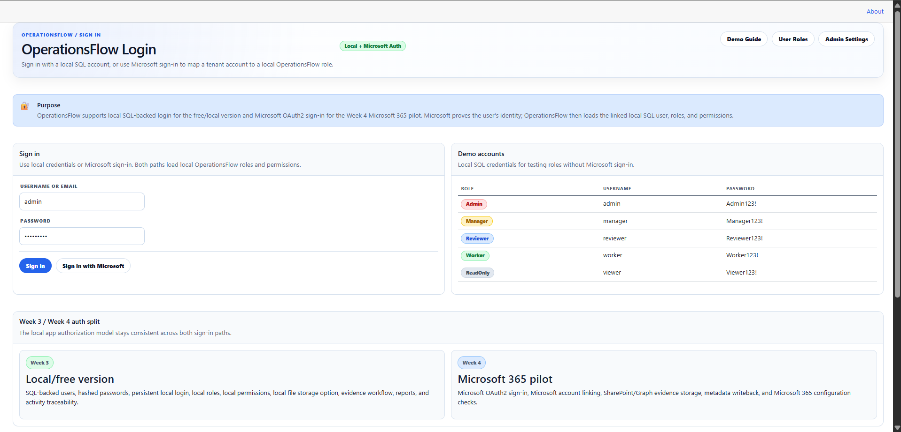
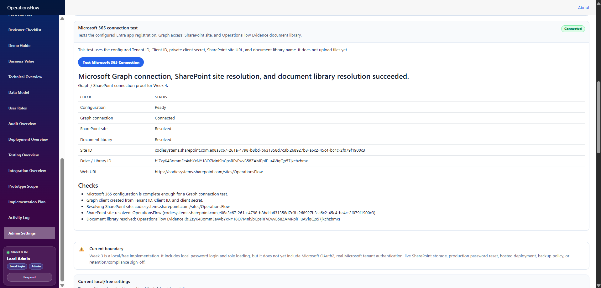
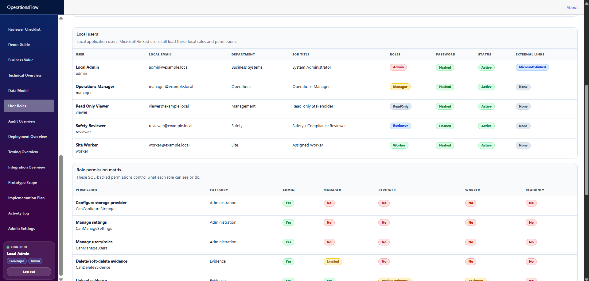
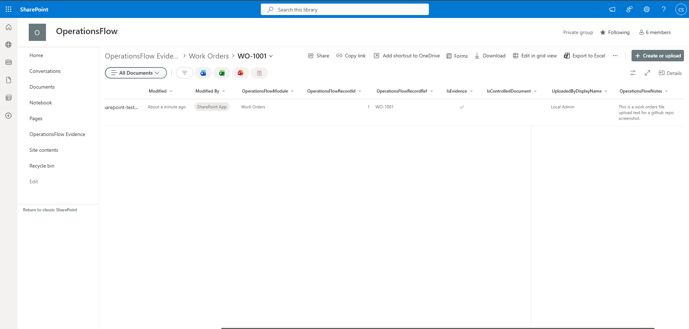
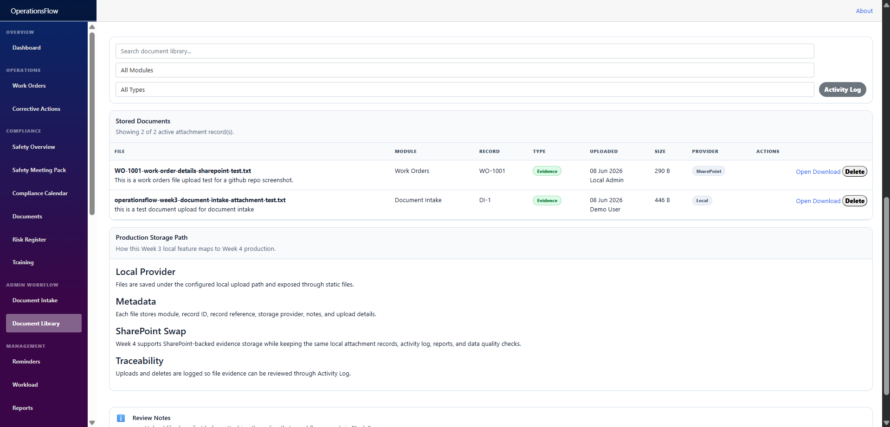
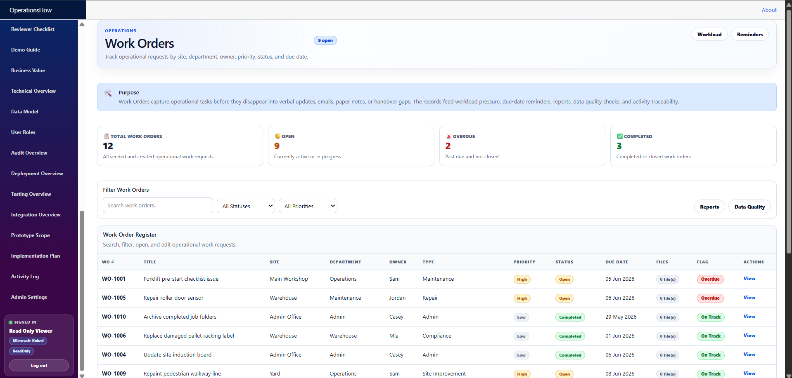

# OperationsFlow

> **Current status:** Week 4 Microsoft 365 pilot implementation is complete. OperationsFlow now has local SQL-backed authentication, Microsoft OAuth2 sign-in, local-vs-Microsoft sign-in status, local SQL roles/permissions, SharePoint-backed evidence storage through Microsoft Graph, SharePoint metadata writeback, document upload/delete lifecycle, current-user activity logging, reporting, data quality checks, and reviewer-ready documentation.

OperationsFlow is **production pilot-ready for a single-tenant Microsoft 365 environment**. It is not being presented as a fully hardened enterprise SaaS platform; it is a working portfolio/pilot system that proves the core business workflow, identity, storage, evidence, reporting, and permission model.

## Project Purpose

OperationsFlow is a practical internal business workflow system built to prove that scattered operational work can be captured, reviewed, prioritised, evidenced, and reported from one place.

It is designed around real workplace patterns:

- work orders and operational requests
- corrective actions and source-linked follow-up work
- document intake and document processing
- controlled document review
- training compliance follow-up
- risk register follow-up
- document/evidence attachments
- management reports
- data quality checks
- activity traceability
- role-based workflow access
- Microsoft 365 / SharePoint evidence storage

## What This Project Demonstrates

- .NET 8 / Blazor application development.
- Entity Framework Core persistence.
- SQLite/local development support and SQL Server/LocalDB production-foundation support.
- Local SQL-backed authentication and seeded demo accounts.
- Microsoft OAuth2 sign-in for tenant accounts.
- Microsoft account to local OperationsFlow user mapping through `ExternalLoginLinks`.
- Local SQL roles and permissions as the application authorization source.
- Enforced page/action permissions for workflow actions, evidence uploads/deletes, exports, settings, and user management.
- Shared UI components and consolidated styling.
- Workflow modules connected through reports, reminders, workload, activity history, and data quality.
- File storage abstraction with local and SharePoint providers.
- SharePoint evidence upload through Microsoft Graph.
- SharePoint metadata writeback for module, record, evidence flag, uploader, and notes.
- Delete lifecycle where OperationsFlow delete removes the SharePoint file and updates local metadata.
- Record-level attachments and central Document Library evidence tracking.
- Evidence-aware data quality and reporting.

## Current Project Metrics

- Local SQL-backed authentication: implemented.
- Microsoft OAuth2 sign-in: implemented.
- Local vs Microsoft-linked status display: implemented.
- Local roles/permissions: implemented.
- ReadOnly permission enforcement: implemented and tested.
- Admin workflow actions: implemented and tested.
- SharePoint file/evidence storage: implemented.
- SharePoint metadata writeback: implemented.
- SharePoint delete lifecycle: implemented.
- Record attachment panels: implemented.
- Document Library: implemented.
- Data Quality missing-evidence checks: implemented.
- Reports evidence coverage: implemented.
- Activity Log current-user upload/delete audit: implemented.
- Microsoft 365 tenant/app/library connection check: implemented.

## Walkthrough Video

A 5-minute silent walkthrough video is available here:

[OperationsFlow — Microsoft 365 Pilot Walkthrough](https://youtu.be/uhaA455rg7c)

The video demonstrates the main Week 4 review path: local and Microsoft sign-in, Microsoft-linked Admin status, Microsoft 365 connection testing, SharePoint evidence upload, metadata writeback, document lifecycle handling, activity logging, and ReadOnly permission enforcement.

## Screenshot Preview

The screenshots below show the strongest Week 4 review path: sign-in, Microsoft 365 connection, role mapping, SharePoint metadata, Document Library provider, and ReadOnly permission enforcement.

### 1. Login / Local + Microsoft sign-in



### 2. Admin Settings / Microsoft 365 connected



### 3. User Roles / Microsoft links



### 4. SharePoint / Metadata writeback



### 5. Document Library / SharePoint provider



### 6. ReadOnly permissions



More screenshots are available in [`Docs/Screenshots`](Docs/Screenshots), ordered by review relevance.

## Core Features

### Authentication

OperationsFlow supports local SQL login and Microsoft OAuth2 login. Microsoft sign-in proves tenant identity; OperationsFlow then maps the Microsoft identity to a local user and loads local roles/permissions.

### Dashboard

Shows operational status, workflow counts, recent activity, and sign-in/authentication status.

### Work Orders

Tracks operational work by site, department, owner, priority, status, due date, file count, details page, activity history, and attachments.

### Corrective Actions

Tracks corrective/improvement actions from incidents, audits, inspections, risks, training gaps, document reviews, and compliance follow-ups.

### Document Intake

Captures incoming document workflow items and links them to record-level attachments and Document Library evidence.

### Document Library

Stores uploaded evidence files with module, record reference, type, uploaded-by, notes, provider, SharePoint URL, and delete lifecycle metadata.

### Record Attachments

Reusable component for Work Orders, Corrective Actions, and Document Intake detail pages. Upload/delete actions are permission-controlled.

### Risk Register / Training / Documents

Compliance pages can create source-linked corrective actions when the signed-in user has workflow edit permission.

### Reports

Shows management pressure, workflow counts, evidence coverage, missing evidence, and cross-module review tables. CSV exports are hidden unless the user has export permission.

### Data Quality

Flags missing or weak data, including priority records that are missing supporting evidence.

### Activity Log

Global traceability page for created, updated, uploaded, deleted, and reviewed events. Upload/delete activity records the current signed-in user.

### User Roles / Admin Settings

Demonstrates the local SQL role/permission model, Microsoft OAuth2 external links, admin configuration boundary, Microsoft 365 connection status, and SharePoint provider configuration.

## Tech Stack

- .NET 8
- Blazor
- C#
- Entity Framework Core
- SQLite for simple local development/demo scenarios
- SQL Server / LocalDB for local auth and production foundation
- Microsoft OAuth2 / Entra app registration
- Microsoft Graph
- SharePoint document library storage
- Local file storage provider
- Reusable Razor components
- CSV exports

## Architecture Summary

```text
Blazor UI
  -> Shared UI components
  -> Workflow pages
  -> Local auth/session services
  -> Microsoft OAuth2 sign-in flow
  -> Local current user service
  -> EF Core services
  -> SQLite or SQL Server/LocalDB
  -> LocalUsers / LocalRoles / LocalPermissions
  -> ExternalLoginLinks
  -> DocumentAttachment metadata
  -> IFileStorageService
       -> LocalFileStorageService
       -> SharePointFileStorageService
            -> Microsoft Graph
            -> SharePoint Evidence Library
```

## Current Limitations

OperationsFlow is a working local/pilot implementation, not a fully hosted enterprise SaaS platform.

Current boundaries:

- Secrets are local development configuration and should be moved to user-secrets, environment variables, or a managed secret store before real deployment.
- Graph permissions should be reviewed and reduced where practical before production rollout.
- The app is not deployed to a hosted production environment yet.
- No formal production backup/monitoring/retention policy is configured yet.
- No external production integrations to Xero, Cin7, WorkflowMax, Outlook, Teams, Planner, or Power BI are connected yet.
- Automated test coverage is still future work.

## Week 3 Completion

Week 3 built the local/free production foundation:

- production-style configuration/options
- file storage abstraction
- local file provider
- DocumentAttachment metadata model/service
- local Document Library
- record-level attachments
- file counts on workflow registers
- evidence-aware Data Quality checks
- evidence coverage Reports
- local SQL Server / LocalDB support
- local SQL-backed users, roles, and permissions
- login page as landing page
- logout and sidebar user status
- sessionStorage login persistence
- protected navigation
- permission-controlled create/edit/upload/delete/export/admin actions
- ReadOnly viewer and Admin permission testing

## Week 4 Completion

Week 4 implemented the Microsoft 365 pilot path:

- Microsoft 365 tenant/test user setup
- SharePoint site and OperationsFlow Evidence document library setup
- Entra app registration and Graph permissions
- Microsoft Graph connection test
- Microsoft OAuth2 sign-in
- Microsoft account to local user mapping
- local SQL roles/permissions retained as authorization source
- SharePoint evidence upload provider
- SharePoint folder mapping by module/record reference
- SharePoint metadata writeback
- SharePoint delete lifecycle from OperationsFlow
- Document Library direct upload parity
- current user audit logging for upload/delete events
- Microsoft-linked vs Local login sidebar status

## Final Positioning

Best honest label:

> **Production pilot-ready single-tenant Microsoft 365 workflow system.**

This means the core pilot works end-to-end, while full customer production rollout would still need hosting, secret management, backup/restore, formal monitoring, retention policy, and least-privilege security review.

## Documentation

- [`Docs/Architecture.md`](Docs/Architecture.md)
- [`Docs/BuildPlan.md`](Docs/BuildPlan.md)
- [`Docs/CaseStudy.md`](Docs/CaseStudy.md)
- [`Docs/DemoWalkthrough.md`](Docs/DemoWalkthrough.md)
- [`Docs/EnterpriseUpgradePlan.md`](Docs/EnterpriseUpgradePlan.md)
- [`Docs/FeatureChecklist.md`](Docs/FeatureChecklist.md)
- [`Docs/KnownLimitations.md`](Docs/KnownLimitations.md)
- [`Docs/ReleaseNotes.md`](Docs/ReleaseNotes.md)
- [`Docs/ReleasePackage.md`](Docs/ReleasePackage.md)
- [`Docs/ScreenshotChecklist.md`](Docs/ScreenshotChecklist.md)
- [`Docs/ScreenshotRenameMap.md`](Docs/ScreenshotRenameMap.md)
- [`Docs/StylingSystem.md`](Docs/StylingSystem.md)
- [`Docs/TargetedPitches.md`](Docs/TargetedPitches.md)
- [`Docs/TechnicalDecisions.md`](Docs/TechnicalDecisions.md)
