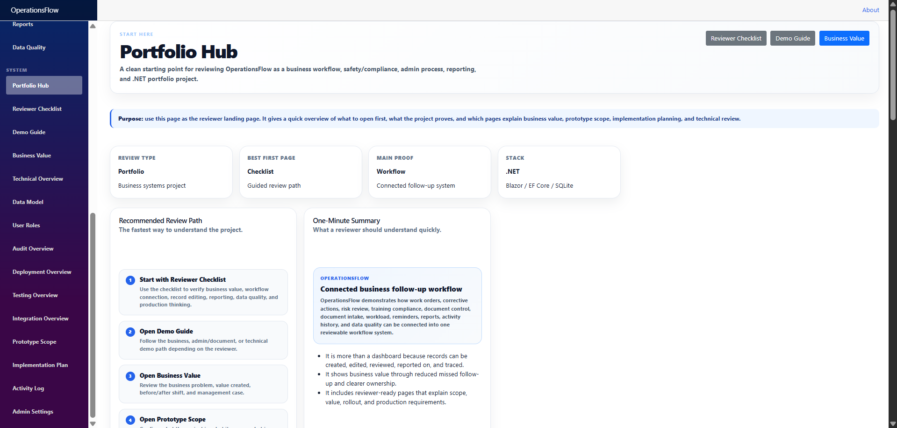
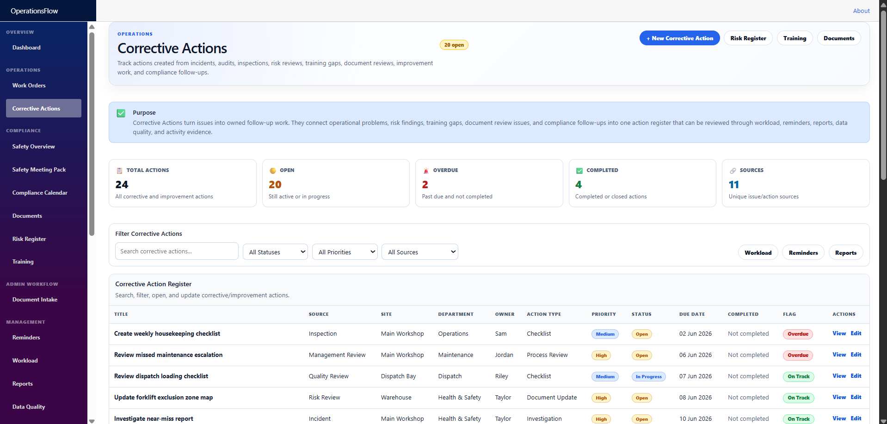
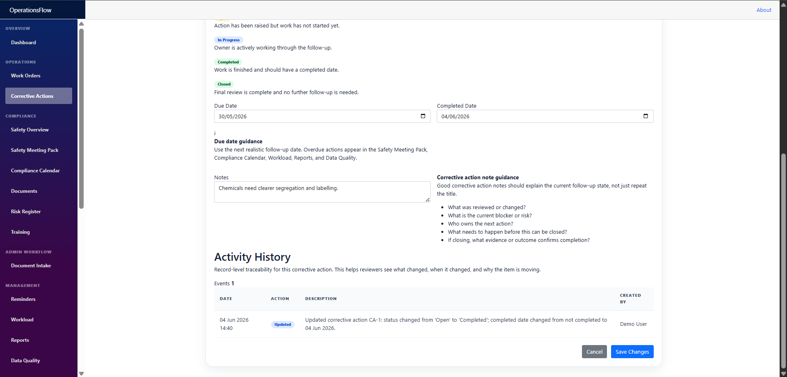
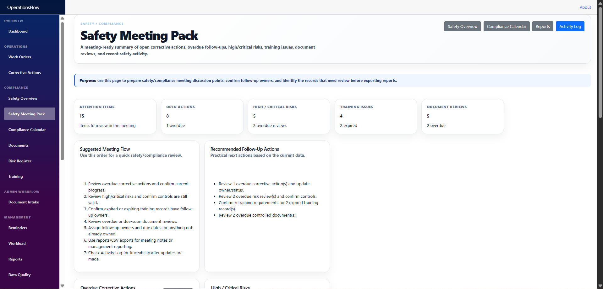
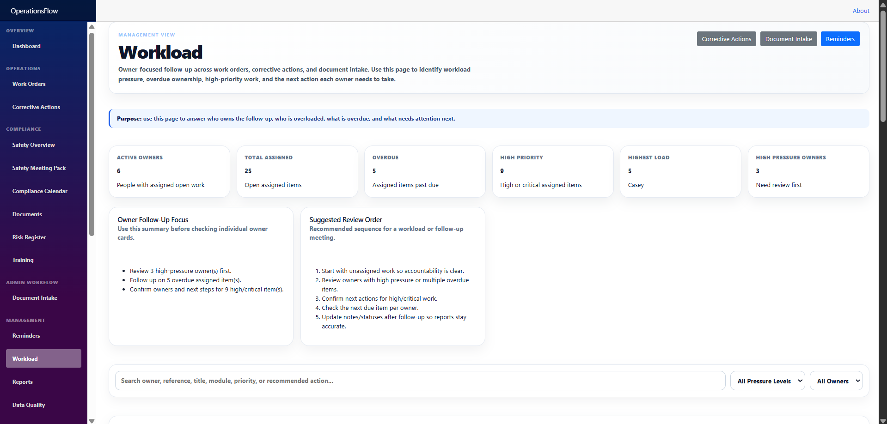
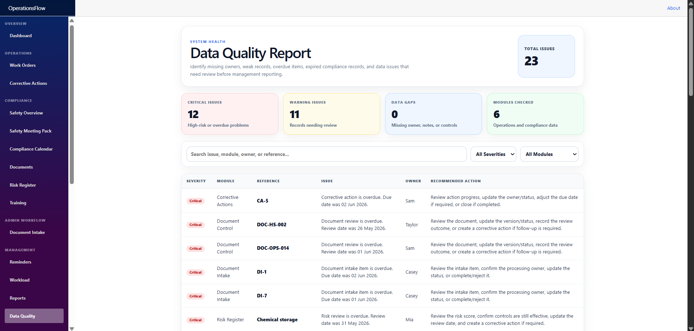

# OperationsFlow

**OperationsFlow** is a Blazor/.NET 8 business workflow prototype for tracking operational work, corrective actions, document intake, safety/compliance review, risk, training, controlled documents, reminders, workload, reports, CSV exports, data quality, activity history, and production planning.

It was built as a focused portfolio project to demonstrate practical business systems development: turning scattered admin, operations, safety/compliance, document, and follow-up work into one connected workflow system.

> **Current status:** OperationsFlow is a local portfolio prototype using SQLite and seeded demo data.
>
> It demonstrates workflow design, record editing, reporting, exports, reminders, workload visibility, activity traceability, data quality checks, reviewer guidance, production planning, testing awareness, deployment planning, and Microsoft 365 integration direction. It is not yet a production deployment and does not currently include real authentication, role permissions, hosted infrastructure, live SharePoint/Teams/Outlook integration, production file storage, or automated test coverage.

---

## Project Purpose

Many small businesses manage operational follow-up through emails, spreadsheets, PDFs, paper forms, shared folders, and manual reminders.

That makes it hard to answer:

- What needs attention today?
- What work is overdue?
- Who owns each action?
- Which safety/compliance items need review?
- Which training records are expired or due soon?
- Which documents need review?
- Which incoming documents still need processing?
- What changed recently?
- What can be exported for management review?
- What would need to change before this became a production business system?

OperationsFlow shows how those workflows could be centralised into a simple internal business system.

---

## Screenshots

OperationsFlow includes a **36-image screenshot review pack** covering the main workflow, safety/compliance pages, admin workflow, reviewer pages, technical review pages, and production planning pages.

See the full [Screenshot Checklist](Docs/ScreenshotChecklist.md) for the complete screenshot list and what each image proves.

### Portfolio Hub



### Corrective Actions



### Corrective Action Edit / Activity History



### Safety Meeting Pack



### Workload



### Data Quality



---

## What This Project Demonstrates

OperationsFlow demonstrates ability to:

- Design practical business workflows around real operational problems.
- Build CRUD modules using C#, Blazor, Entity Framework Core, and SQLite.
- Create dashboard KPIs, reports, reminders, CSV exports, workload views, and data quality checks.
- Track activity history globally and per record.
- Model admin/document intake, compliance follow-up, risk, training, controlled documents, and corrective actions.
- Explain a prototype clearly for business reviewers, technical reviewers, and future production planning.
- Separate current prototype functionality from future production requirements.
- Plan a realistic Microsoft 365 upgrade path using SharePoint, Teams, Outlook, identity, reporting exports, and integrations.

---

## Current Project Metrics

Current prototype includes:

- Blazor/.NET 8 app
- SQLite persistence
- EF Core data layer
- Seeded demo data
- Dashboard and management overview
- Work Orders workflow
- Corrective Actions workflow
- Document Intake workflow
- Safety Overview
- Safety Meeting Pack
- Compliance Calendar
- Controlled Documents
- Risk Register
- Training Compliance
- Reminder Centre
- Workload review
- Reports page
- CSV export endpoints
- Data Quality page
- Global Activity Log
- Per-record Activity History
- Admin Settings starter
- Portfolio Hub
- Reviewer Checklist
- Demo Guide
- Business Value page
- Prototype Scope page
- Implementation Plan
- Technical Overview
- Data Model overview
- User Roles overview
- Audit Overview
- Deployment Overview
- Testing Overview
- Microsoft 365 / Integration Overview
- 36-image screenshot review package

---

## Best Review Path

For someone reviewing the project without a live spoken demo, start here:

1. **Portfolio Hub** — starting point for reviewers.
2. **Reviewer Checklist** — what to click, verify, and assess.
3. **Demo Guide** — guided walkthrough paths.
4. **Business Value** — why the workflow matters.
5. **Corrective Actions** — editable workflow record example.
6. **Safety Meeting Pack** — connected compliance review page.
7. **Workload** — owner-based management visibility.
8. **Reports** — management summaries and export concepts.
9. **Data Quality** — weak record and system health checks.
10. **Technical Overview** — stack, architecture, and production direction.
11. **Deployment Overview** — what would be needed before real rollout.
12. **Integration Overview** — Microsoft 365 / SharePoint / Teams / Outlook direction.

---

## Core Features

### Dashboard

- KPI cards.
- Summary panels.
- Recent activity feed.
- Links into main workflow modules.

### Work Orders

- List, search, and filter.
- Create work order.
- Edit work order.
- View work order details.
- Per-record activity history.
- Overdue tracking.
- Dashboard/report integration.
- CSV export.

### Corrective Actions

- List, search, and filter.
- Create corrective action.
- Edit corrective action.
- Owner, priority, status, due date, completed date, and notes.
- Status guidance.
- Completed date behaviour.
- Activity logging.
- Per-record activity history shown on the edit/review page.
- Corrective actions can be generated from risk, document, and training modules.

### Document Intake

Tracks incoming admin/document work such as:

- Emails
- PDFs
- Scanned documents
- Supplier documents
- Customer requests
- Internal forms
- Job paperwork

Fields include:

- Document name
- Received date
- Received from
- Source type
- Document type
- Assigned to
- Target system
- Priority
- Status
- Due date
- Completed date
- Notes

Target systems are tracked as workflow metadata only. The current app does not live-integrate with those systems yet.

### Compliance Modules

- Safety Overview
- Safety Meeting Pack
- Compliance Calendar
- Controlled Documents
- Risk Register
- Training Compliance

Risk items, document reviews, and training issues can generate corrective actions.

### Management Views

- Reminder Centre
- Workload
- Reports
- Data Quality
- Activity Log
- Admin Settings starter

### Reviewer / Portfolio Pages

- Portfolio Hub
- Reviewer Checklist
- Demo Guide
- Business Value
- Prototype Scope
- Implementation Plan
- Technical Overview
- Data Model
- User Roles
- Audit Overview
- Deployment Overview
- Testing Overview
- Integration Overview

These pages make the project reviewable without needing a spoken demo.

---

## Tech Stack

- .NET 8
- Blazor
- C#
- Entity Framework Core
- SQLite
- Razor Components
- HTML/CSS
- CSV export endpoints
- Git/GitHub

---

## Architecture

Current prototype structure:

```text
Blazor UI
    ↓
Razor Components / Pages
    ↓
Application Services
    ↓
Entity Framework Core
    ↓
SQLite Database
```

Current services include:

- `DashboardService`
- `ActivityLogService`
- `CsvExportService`

Future production direction:

```text
Blazor UI
    ↓
Application Services
    ↓
Domain / Business Rules
    ↓
Infrastructure
    ↓
SQL Server / Azure SQL / PostgreSQL
    ↓
Authentication / Permissions / Integrations
```

---

## CSV Exports

CSV export endpoints support management review and spreadsheet workflows.

Export areas include:

- Work Orders
- Corrective Actions
- Risk Register
- Training
- Document Reviews
- Activity Log
- Document Intake

---

## Current Prototype vs Future Production Version

| Area | Current Prototype | Future Production Version |
|---|---|---|
| Database | Local SQLite | SQL Server, Azure SQL, or PostgreSQL |
| Data | Seeded demo data | Real business data with migrations/backups |
| Users | Demo user text | Authentication and role-based permissions |
| Settings | Starter Admin Settings page | Database-driven editable settings |
| Activity | Global Activity Log and per-record Activity History | Per-field audit trail with old/new values and authenticated user IDs |
| Documents | Document metadata and workflow tracking | Controlled file storage, preview, document security, and review history |
| Integrations | Target systems tracked as metadata only | SharePoint, Outlook, Teams, Microsoft Lists, Power BI/Excel exports, APIs |
| Reporting | App reports and CSV exports | Scheduled reporting, approved KPI definitions, Power BI feed |
| Deployment | Local development/demo app | Hosted production deployment |
| Testing | Manual build/run/click-through testing | Unit tests, integration tests, UI regression checks, CI/CD pipeline |
| Security | No real auth yet | Microsoft identity or another authentication provider |

---

## How To Run

1. Clone the repository.
2. Open the solution in Visual Studio or VS Code.
3. Restore NuGet packages if required.
4. Run the Blazor app.

CLI option:

```bash
dotnet restore
dotnet build
dotnet run
```

If the SQLite schema changes during prototype development, delete local database files and restart the app:

- `operationsflow.db`
- `operationsflow.db-shm`
- `operationsflow.db-wal`

---

## Current Prototype Limitations

This is a portfolio prototype, not a production enterprise deployment.

Current limitations:

- Uses local SQLite.
- Uses seeded demo data.
- No real authentication.
- No role-based permissions.
- No hosted deployment.
- No live SharePoint/Teams/Outlook/Microsoft Lists/Power BI integrations.
- No live Xero/Cin7/WorkflowMax integration.
- No production file storage.
- No automated test suite yet.
- Some option lists are still hardcoded in forms.
- Database schema management is prototype-level rather than production migration-managed.
- CSS needs cleanup/refactor after rapid build-out.

---

## Production Upgrade Path

Planned production upgrades:

- Service-layer refactor.
- SQL Server, PostgreSQL, or Azure SQL support.
- EF Core migrations.
- Authentication with Microsoft Entra ID or ASP.NET Core Identity.
- Role-based permissions.
- Database-driven admin settings.
- Per-field audit trail.
- File upload/document attachment support.
- SharePoint document library integration.
- Outlook email intake.
- Teams/email notifications.
- Microsoft Lists or API integration where useful.
- CSV/Excel/Power BI-ready reporting outputs.
- Unit and integration tests.
- UI regression checks.
- Deployment pipeline.
- Production hosting, backups, monitoring, and support process.

---

## Additional Documentation

- [Case Study](Docs/CaseStudy.md)
- [Architecture](Docs/Architecture.md)
- [Technical Decisions](Docs/TechnicalDecisions.md)
- [Demo Walkthrough](Docs/DemoWalkthrough.md)
- [Feature Checklist](Docs/FeatureChecklist.md)
- [Screenshot Checklist](Docs/ScreenshotChecklist.md)
- [Release Package](Docs/ReleasePackage.md)
- [CSS Cleanup Plan](Docs/CssCleanupPlan.md)
- [Known Limitations](Docs/KnownLimitations.md)
- [Enterprise Upgrade Plan](Docs/EnterpriseUpgradePlan.md)
- [Targeted Pitch Notes](Docs/TargetedPitches.md)
- [Build Plan](Docs/BuildPlan.md)

---

## Portfolio Summary

OperationsFlow is a practical business systems portfolio project built with C#, Blazor, EF Core, SQLite, workflow logic, reporting, exports, data quality checks, and traceability.

It shows the ability to design and build software that businesses understand: tracking work, assigning responsibility, monitoring compliance, showing what needs attention, exporting data, supporting management review, and planning a realistic production upgrade path.
